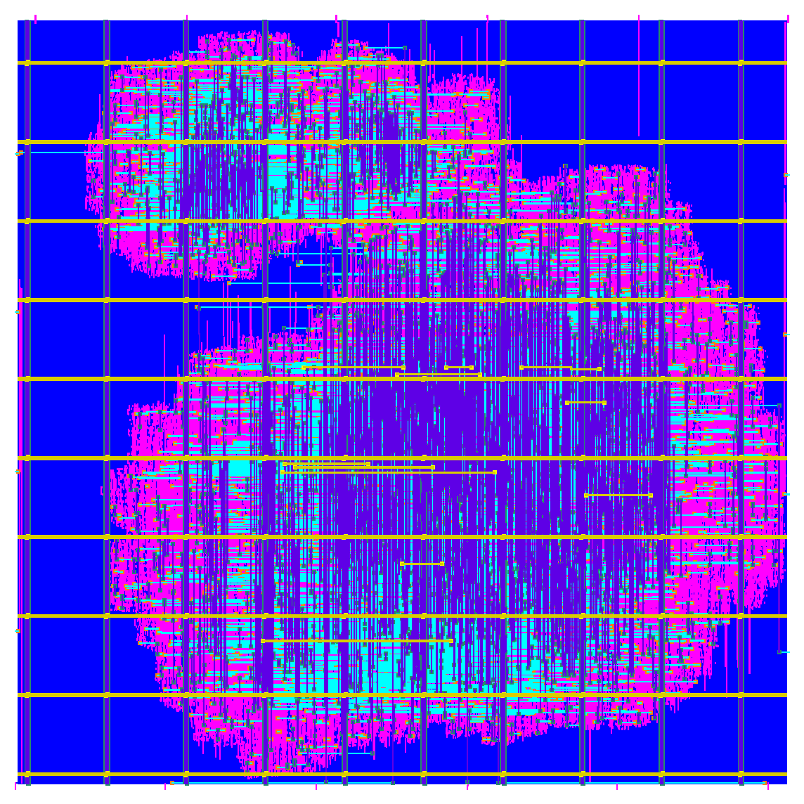

# PicoRV32 Custom SoC

<p align="center">
  
</p>

<p align="center">
Final routed layout generated using the OpenLane physical design flow targeting the SKY130A PDK.
</p>

---

## Overview

This project explores the complete digital ASIC design flow by building a custom RISC-V System-on-Chip around the PicoRV32 processor.

The design integrates a set of memory-mapped peripherals, executes bare-metal firmware compiled with the RISC-V GNU toolchain, and is implemented using the open-source OpenLane flow. The project follows the entire hardware development process from RTL design and functional verification to physical implementation and GDSII generation.

---

## Features

- PicoRV32 RISC-V CPU
- Memory-mapped peripheral bus
- GPIO
- Timer
- PWM generator
- UART transmitter
- Internal RAM
- Bare-metal firmware execution
- OpenLane ASIC implementation
- SKY130A technology

---

## Architecture

<p align="center">

```text
                    PicoRV32
                        │
             Native Memory Interface
                        │
        ┌───────────────┴───────────────┐
        │                               │
   Internal RAM                 Peripheral Bus
                                        │
             ┌──────────┬──────────┬──────────┐
             │          │          │          │
           GPIO       Timer       PWM      UART TX
```

</p>

---

## Repository Structure

```text
picorv32_custom/
├── rtl/            Verilog source files
├── tb/             RTL testbenches
├── firmware/       Bare-metal software
├── scripts/        Build and simulation scripts
├── sim/            Simulation outputs
├── docs/
│   └── images/
└── README.md
```

---

## Memory Map

| Address | Peripheral |
|----------|------------|
| `0x30000000` | GPIO |
| `0x30000008` | Timer |
| `0x30000018` | PWM |
| `0x30000024` | UART |

---

## Design Flow

```text
RTL Design
     │
     ▼
RTL Simulation
     │
     ▼
Peripheral Verification
     │
     ▼
SoC Integration
     │
     ▼
Bare-metal Firmware
     │
     ▼
Logic Synthesis
     │
     ▼
Floorplanning
     │
     ▼
Placement
     │
     ▼
Clock Tree Synthesis
     │
     ▼
Routing
     │
     ▼
Static Timing Analysis
     │
     ▼
Final GDSII
```

---

## Verification

Each peripheral was verified individually before system integration.

The final RTL simulation verifies that

- the PicoRV32 fetches instructions from the internal RAM,
- the firmware executes correctly,
- memory-mapped transactions are decoded correctly,
- GPIO registers are successfully written by software.

---

## Physical Implementation

The physical implementation was completed using OpenLane targeting the SKY130A standard-cell library.

The flow includes

- Logic synthesis
- Floorplanning
- Power distribution
- Placement
- Clock Tree Synthesis
- Global routing
- Detailed routing
- Static Timing Analysis
- GDSII generation

The generated layout was inspected using both OpenROAD and KLayout.

---

## Tools

| Stage | Tool |
|--------|------|
| RTL Design | Verilog |
| Simulation | Icarus Verilog |
| Firmware | RISC-V GNU Toolchain |
| Synthesis | Yosys |
| Physical Design | OpenLane / OpenROAD |
| Layout Inspection | KLayout |
| Technology | SKY130A PDK |

---

## Current Status

- [X] PicoRV32 integration
- [X] Memory-mapped peripheral bus
- [X] GPIO
- [X] Timer
- [X] PWM
- [X] UART transmitter
- [X] Bare-metal firmware execution
- [X] RTL verification
- [X] OpenLane implementation
- [X] Final GDSII generation

---

## Future Work

Possible extensions include

- Interrupt controller
- SPI master
- I²C master
- SRAM macro integration
- Timing optimization
- Improved physical design constraints

---
