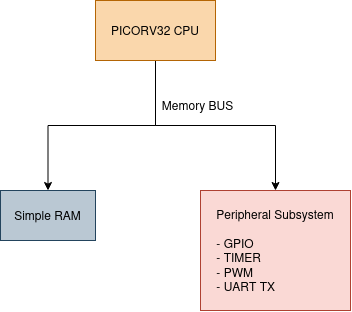
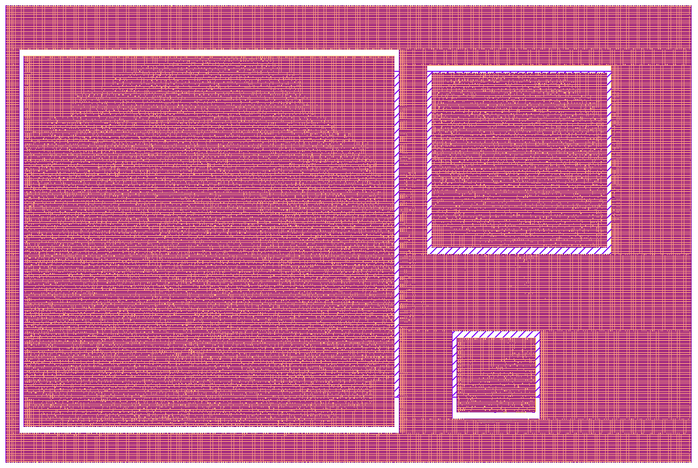
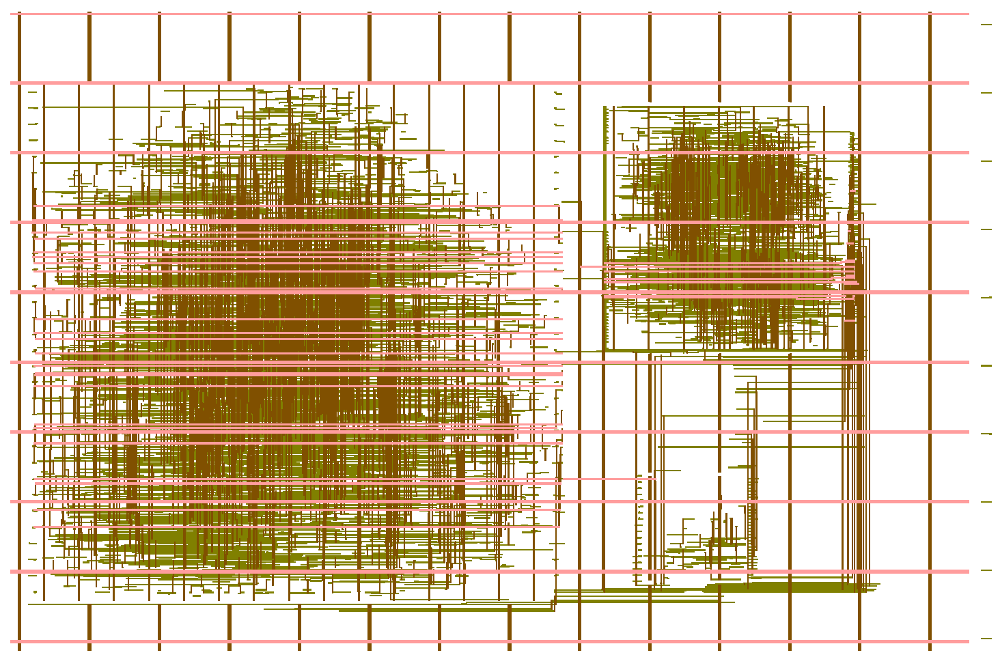

# PicoRV32 Custom SoC - Hierarchical ASIC Implementation

A complete hierarchical RTL-to-GDSII ASIC implementation of a custom RISC-V System-on-Chip using the open-source OpenLane/OpenROAD flow and the SKY130A Process Design Kit.

This project demonstrates a complete digital ASIC implementation flow, from RTL integration to physical verification, using a hierarchical floorplan composed of multiple hard macros. The primary objective is to build a realistic ASIC portfolio project that resembles an industrial digital implementation rather than a simple academic example.

---

# Project Overview

The SoC is centered around the PicoRV32 RISC-V processor and integrates custom memory and peripheral subsystems through a memory-mapped interface.

The complete physical implementation was performed using OpenLane with the SKY130A technology and successfully reached GDSII generation after floorplanning, power distribution, placement, clock tree synthesis, routing, and physical verification.

---

# System Architecture

## System Architecture Diagram

<p align="center">
  
</p>

The following diagram illustrates the hierarchical organization of the custom SoC. The PicoRV32 processor communicates with the Simple RAM and the custom peripheral subsystem through a memory-mapped bus interface. The peripheral subsystem integrates GPIO, Timer, PWM, and UART modules, providing programmable hardware functionality while keeping the overall design modular and scalable.

---

# RTL Modules

```
soc.v
picorv32.v
simple_ram.v
timer.v
uart_tx.v
pwm.v
```

---

# Physical Design Flow

The implementation followed the standard OpenLane digital ASIC flow:

1. RTL Integration
2. Logic Synthesis
3. Floorplanning
4. Macro Placement
5. Power Distribution Network Generation
6. Placement
7. Clock Tree Synthesis
8. Global Routing
9. Detailed Routing
10. Physical Verification
11. GDSII Generation

---

# Hierarchical Floorplan



The design uses a hierarchical floorplan where the CPU, RAM, and peripheral subsystem are implemented as independent hard macros and integrated at the top level.

---

# Final Layout



The final routed layout was generated using OpenROAD and successfully passed the complete physical verification flow.

---

# Physical Design Results

| Parameter | Value |
|-----------|------:|
| Technology | SKY130A |
| Die Size | 2200 µm × 1500 µm |
| Die Area | 3.30 mm² |
| Components | 119,851 |
| Top-level Pins | 22 |
| Signal Nets | 333 |
| Routed Signal Nets | 332 |
| Total Wire Length | 263.76 mm |
| Average Net Length | 794.47 µm |
| Target Clock | 20 ns |
| Target Frequency | 50 MHz |

---

# Verification Results

The final implementation successfully completed all major physical verification stages.

| Verification | Result |
|-------------|--------|
| Detailed Routing DRC | Passed |
| Magic DRC | 0 Violations |
| LVS | Passed |
| KLayout XOR | Passed |
| WNS | 0.00 ns |
| TNS | 0.00 ns |

The final antenna report contains 27 reported antenna entries, which remain as known post-route optimization items.

---

# Challenges During Implementation

One of the major challenges encountered during the project was hierarchical power distribution.

Initially, the Power Distribution Network could not be generated because one hard macro exported Metal5 power pins that conflicted with the top-level PDN strategy. After modifying the macro LEF and aligning the PDN implementation, the design successfully completed routing and signoff.

This project also involved multiple iterations of floorplanning and routing before obtaining a clean final implementation.

---

# Generated Outputs

The final implementation generated:

- GDSII
- DEF
- LEF
- Verilog Netlist
- SDF
- SPEF
- LVS Reports
- DRC Reports

---

# Tools Used

- Verilog HDL
- PicoRV32
- OpenLane
- OpenROAD
- Magic VLSI
- Netgen
- KLayout
- SKY130A PDK

---

# Future Improvements

Future work may include:

- Interrupt controller
- SPI peripheral
- I²C peripheral
- Hardware multiplier
- Cache memory
- Power optimization
- Improved antenna fixing
- Timing optimization
